<p align="center">
  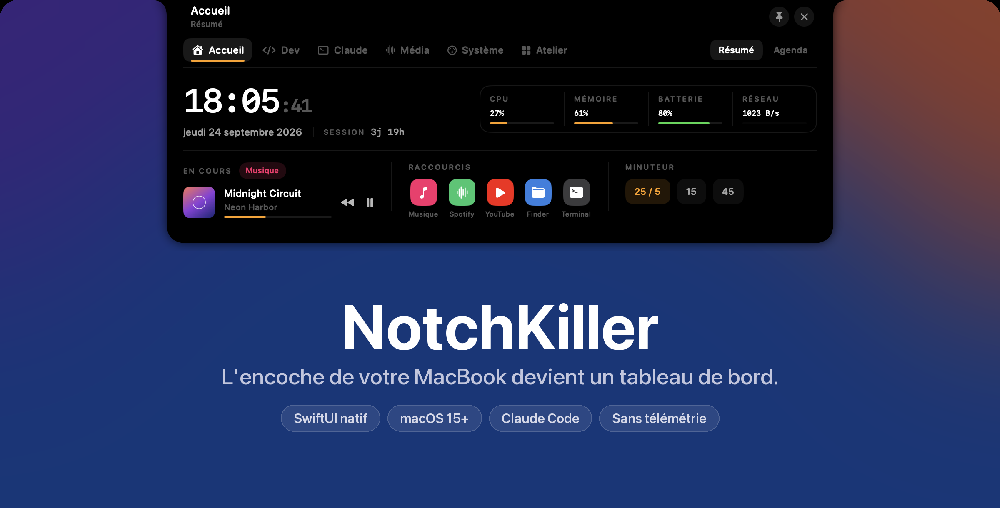
</p>

<p align="center">
  <a href="https://github.com/LeChar111/NotchKiller/releases/latest"></a>
  
  
  <a href="LICENSE"></a>
</p>

<p align="center">
  <b>NotchKiller</b> transforme l'encoche du MacBook en tableau de bord : ce qui joue,<br>
  ce que font vos sessions Claude Code, l'état de la machine et vos outils de dev,<br>
  à un survol de souris. Natif SwiftUI, sans compte, sans télémétrie.
</p>

<p align="center">
  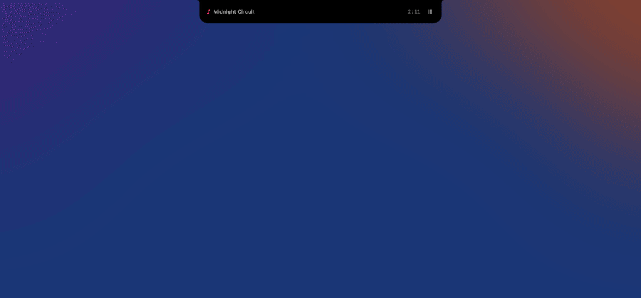
  <br><sub><a href="docs/assets/demo.mp4">Voir la vidéo en haute définition (MP4)</a></sub>
</p>

---

## Sommaire

- [Le bandeau fermé](#le-bandeau-fermé)
- [Les onglets](#les-onglets) — Accueil · Dev · Claude · Média · Système · Atelier
- [Installation](#installation)
- [Intégration Claude Code](#intégration-claude-code)
- [Réglages](#réglages)
- [Mode démo et visuels](#mode-démo-et-visuels)
- [Confidentialité](#confidentialité)
- [Licence](#licence)

## Le bandeau fermé

Fermée, l'encoche reste discrète mais utile : elle affiche l'activité en cours
de chaque côté de la caméra et fait défiler les activités simultanées toutes les
cinq secondes. Un balayage horizontal passe à la suivante, un balayage vers le
bas ou un clic ouvre le panneau.

<p align="center">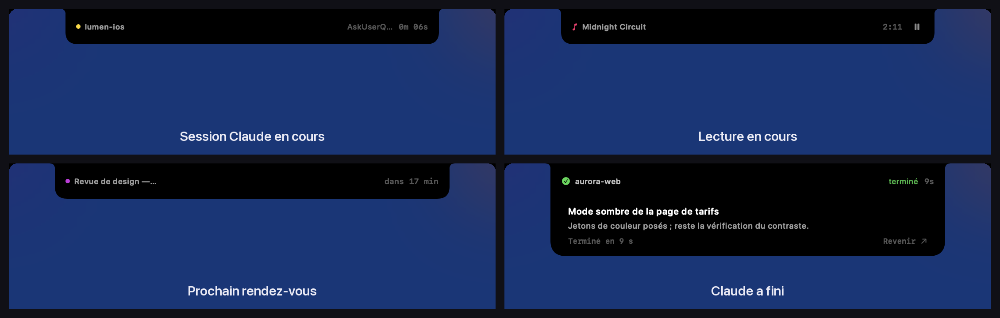</p>

Quand une réponse de Claude Code se termine (au-delà de 5 s de travail), un
tiroir descend sous l'encoche avec le résumé de la session et un lien pour
revenir au bon terminal. Volume et luminosité y remplacent aussi le HUD de
macOS, et les connexions Bluetooth, alertes batterie et notifications peuvent
s'y afficher.

## Les onglets

### Accueil

Horloge, charge de la machine, lecture en cours, raccourcis et minuteur Pomodoro,
plus l'agenda des 36 prochaines heures.

| Résumé | Agenda |
|:---:|:---:|
| 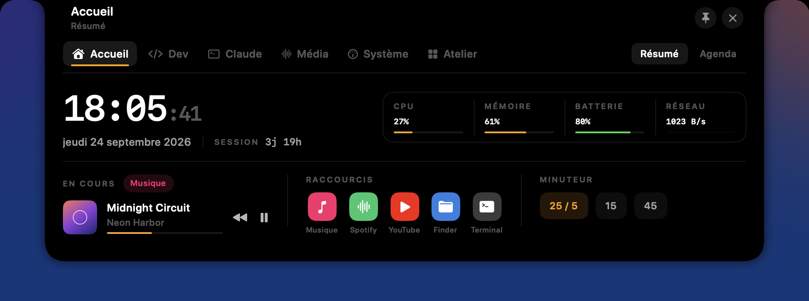 | 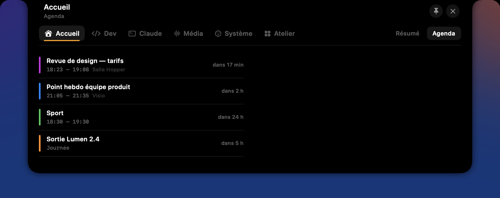 |

### Dev

Projets récents (dépôts sous vos racines et projets déjà ouverts par Claude Code)
avec leur branche, choix de l'éditeur par défaut, ports TCP en écoute à libérer
d'un clic, conteneurs Docker et un mini-terminal pour lancer une commande sans
changer de fenêtre.

| Projets | Ports |
|:---:|:---:|
| 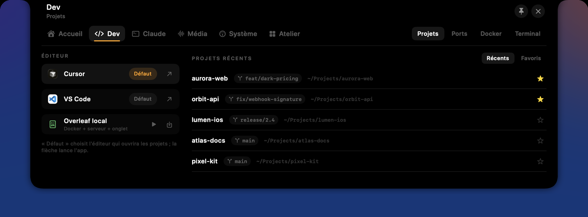 | 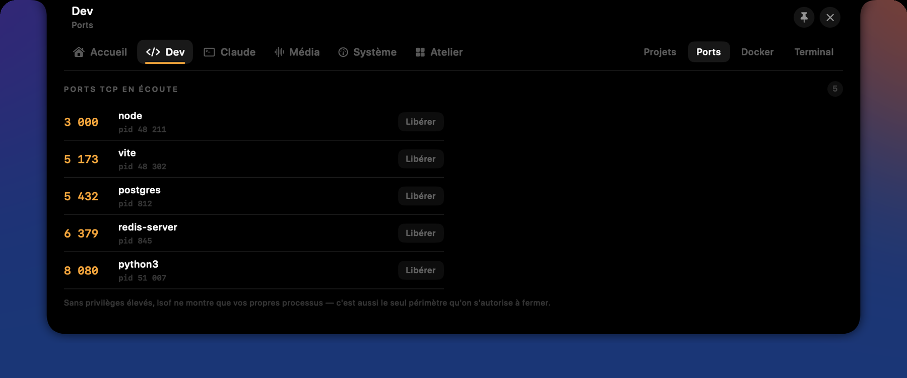 |
| **Docker** | **Terminal** |
| 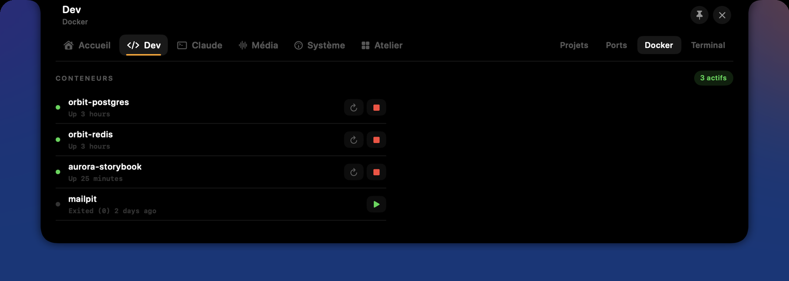 | 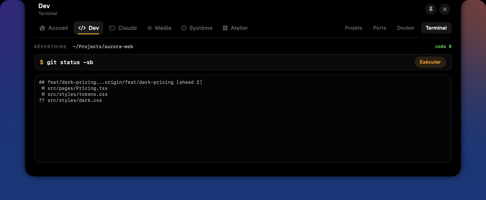 |

### Claude

Toutes les sessions Claude Code actives avec leur état (travaille, en attente,
compacte), le dernier outil appelé et un résumé rédigé par Claude lui-même ;
l'historique par profil, avec reprise des sessions interrompues ; et l'écran de
configuration des hooks et du serveur MCP.

| Sessions | Historique |
|:---:|:---:|
| 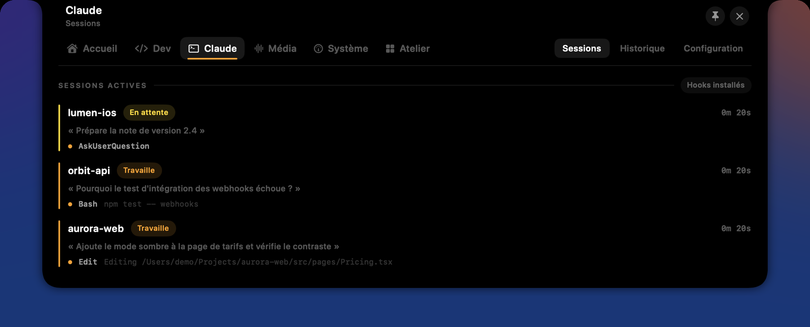 | 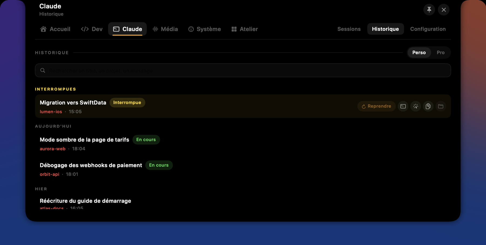 |

<p align="center">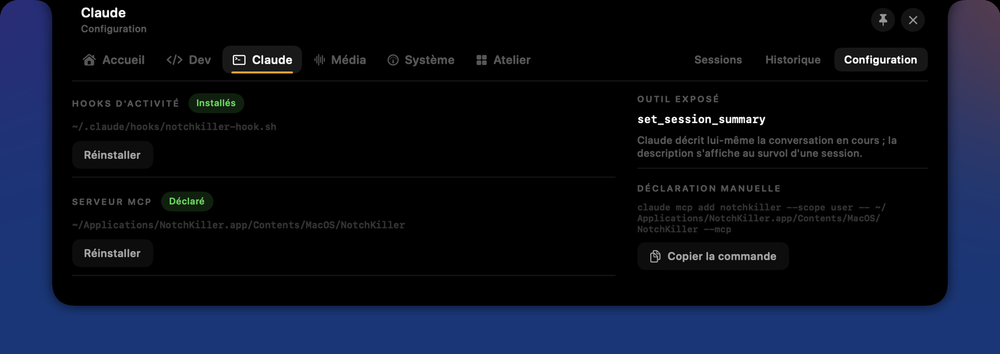</p>

### Média

Lecteur pour Musique et Spotify (pochette, progression, commandes) et playlists
épinglées, y compris à partir d'un lien copié.

<p align="center"></p>

### Système

Statistiques en direct, processus regroupés par application, mémoire et swap
(avec ce qui les retient), nettoyage des `node_modules`, caches et artefacts de
build, batterie et appareils Bluetooth, volume et luminosité.

| Statistiques | Processus |
|:---:|:---:|
| 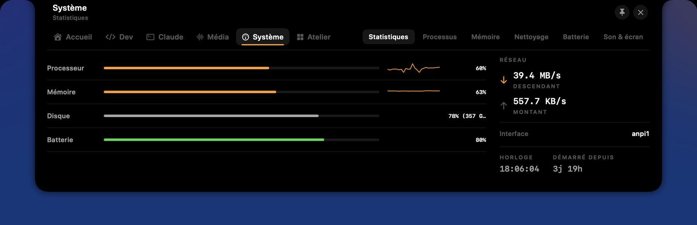 | 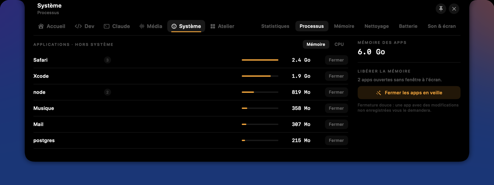 |
| **Mémoire** | **Nettoyage** |
| 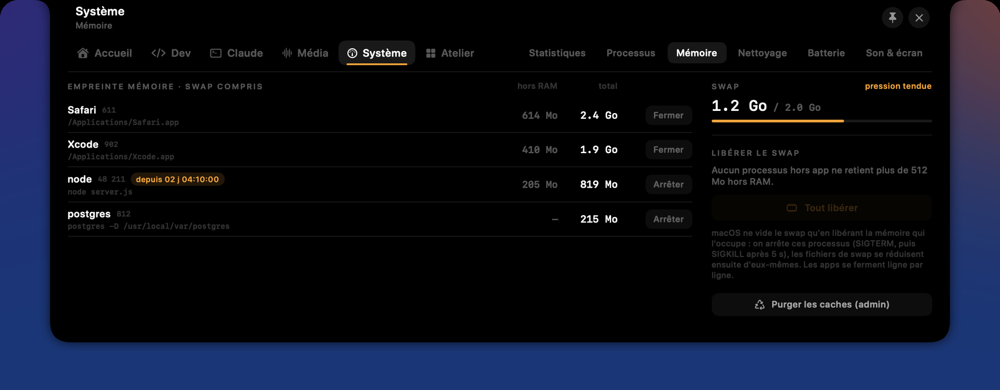 | 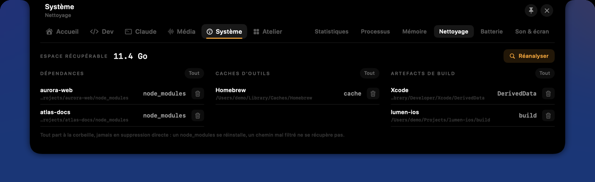 |
| **Batterie** | **Son et écran** |
| 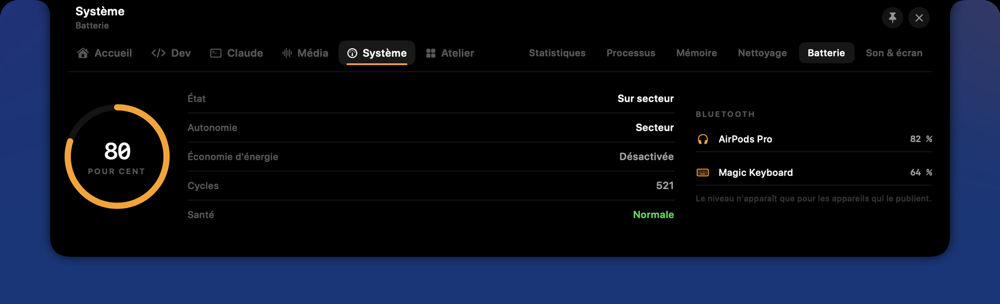 | 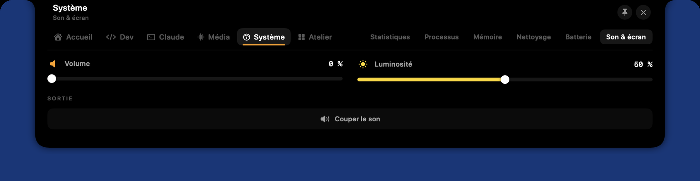 |

### Atelier

Une étagère où déposer fichiers, liens et textes, l'historique du presse-papiers
(le type de contenu est détecté), des notes, une calculatrice, des actions
rapides (captures, veille, apps ouvertes) et les réglages.

| Étagère | Presse-papiers |
|:---:|:---:|
| 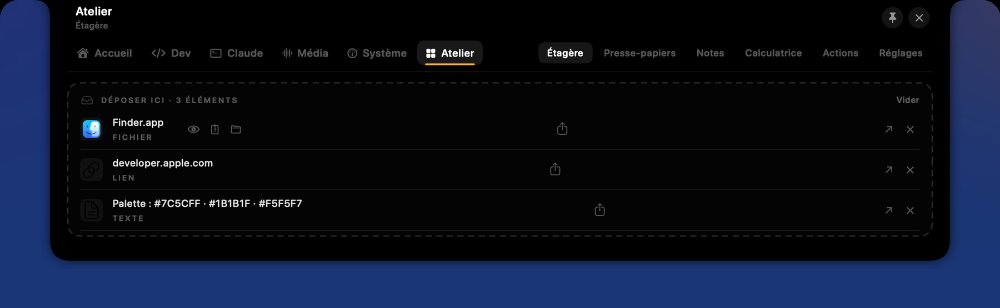 | 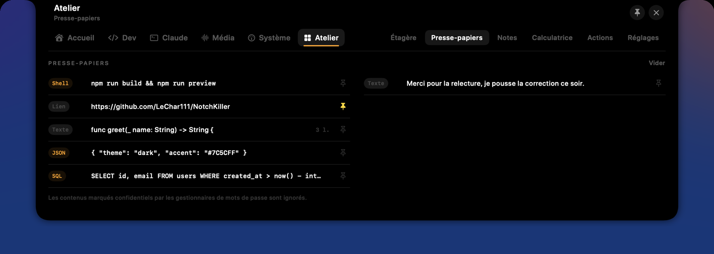 |
| **Notes** | **Calculatrice** |
|  | 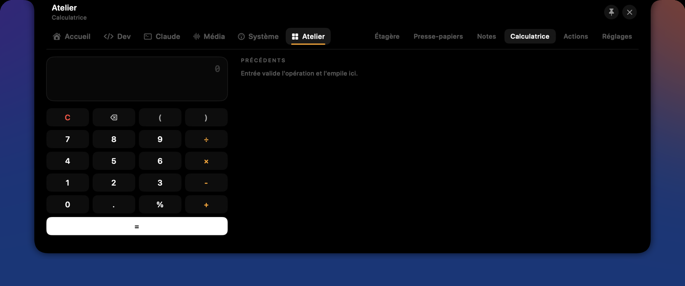 |
| **Actions** | **Réglages** |
| 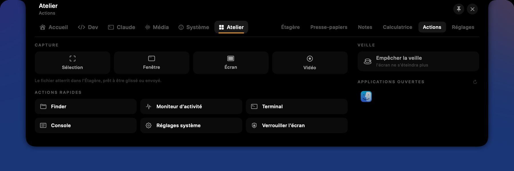 | 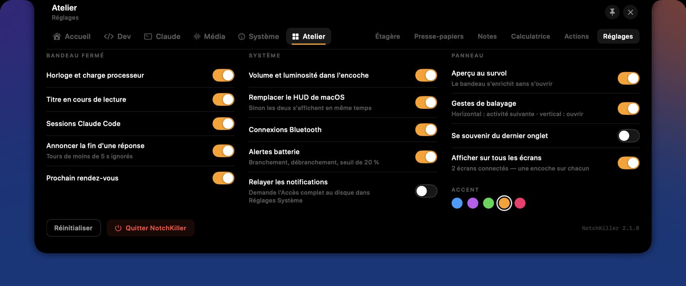 |

## Installation

Prérequis : **macOS 15 (Sequoia) ou plus récent**, sur un Mac avec ou sans
encoche (sans encoche, NotchKiller en dessine une au centre de la barre des
menus).

### Télécharger

Récupérez le `.dmg` de la [dernière version](https://github.com/LeChar111/NotchKiller/releases/latest)
et glissez l'app dans Applications. Le binaire est universel (Apple Silicon et
Intel).

L'app est signée ad hoc mais pas notariée : au premier lancement, faites
**clic droit → Ouvrir**, ou passez par **Réglages Système → Confidentialité et
sécurité → Ouvrir quand même**.

### Compiler depuis les sources

Il faut les Xcode Command Line Tools (`xcode-select --install`).

```bash
git clone https://github.com/LeChar111/NotchKiller.git
cd NotchKiller
./install.sh      # compile, copie dans ~/Applications et active le lancement à l'ouverture de session
```

- `./build.sh` compile seulement, dans `build/NotchKiller.app`.
- `./uninstall.sh` retire l'app et son LaunchAgent.
- `./release.sh` produit le `.zip` et le `.dmg` universels dans `dist/`.
- Le projet Xcode `NotchKiller.xcodeproj` est aussi fourni.

Les autorisations macOS (Calendrier, Automatisation) sont liées à la signature :
avec une signature ad hoc, elles sont redemandées à chaque compilation.
`Tools/setup-signing.sh` crée un certificat local durable pour y remédier.

## Intégration Claude Code

Au premier lancement, NotchKiller installe deux choses, qu'on peut revoir ou
réinstaller depuis **Claude → Configuration** :

- **Des hooks** (`~/.claude/hooks/notchkiller-hook.sh`, déclarés dans
  `~/.claude/settings.json`) qui relaient les événements de chaque session à
  l'app par un socket Unix local : prompt envoyé, outil appelé, attente d'une
  réponse, fin de tour.
- **Un serveur MCP** (le binaire lui-même, lancé avec `--mcp`) qui expose
  l'outil `set_session_summary` : Claude y décrit la conversation en cours, et
  ce résumé s'affiche au survol de la session.

Les profils multiples (`~/.claude`, `~/.claude-*`) sont pris en charge. Avant la
première déclaration du serveur MCP, chaque `.claude.json` est copié en
`.claude.json.notchkiller-backup`.

## Réglages

L'essentiel se règle dans **Atelier → Réglages** : ce qu'affiche le bandeau
fermé, le remplacement du HUD système, les gestes, l'affichage sur tous les
écrans et la couleur d'accent.

Deux réglages optionnels n'ont pas d'écran dédié :

```bash
# Image disque APFS sur un SSD externe : active le bouton de montage (Atelier → Actions)
defaults write io.github.lechar111.notchkiller disk.imagePath /Volumes/SSD/Apps.sparsebundle

# Dossier du toolkit Overleaf local (défaut : ~/Documents/Projects/overleaf-toolkit)
defaults write io.github.lechar111.notchkiller dev.overleafToolkit ~/chemin/vers/overleaf-toolkit
```

## Mode démo et visuels

Toutes les captures de cette page viennent du **mode démo** : lancé avec
`--demo`, NotchKiller remplace chaque donnée personnelle (agenda, sessions,
projets, presse-papiers, processus…) par un jeu fictif et n'écrit rien dans la
configuration de Claude Code.

```bash
./build.sh
open -n build/NotchKiller.app --args --demo
Tools/demo.sh open claude sessions   # ouvre le panneau sur un onglet et une sous-page
Tools/demo.sh bar music              # fige le bandeau fermé sur une activité
Tools/demo.sh done                   # déclenche le tiroir « Claude a fini »
Tools/demo.sh close
```

`Tools/media/capture.sh` régénère l'ensemble des visuels de `docs/assets`
(captures, planche du bandeau, vidéo, GIF, bannière et aperçu social) après une
évolution de l'interface. Il faut `ffmpeg`, Python avec Pillow et l'autorisation
« Enregistrement de l'écran » pour le terminal ; vos réglages sont sauvegardés
puis restaurés.

## Confidentialité

NotchKiller ne collecte rien et n'envoie rien. Tout reste sur la machine :
EventKit pour l'agenda, AppleScript pour Musique et Spotify, `lsof`, `ps` et
`docker` pour la page Dev, et un socket Unix local pour Claude Code. Le seul
accès réseau récupère les métadonnées (titre, pochette) des playlists que vous
épinglez à partir d'un lien.

## Licence

[GPL-3.0](LICENSE) © LeChar111
